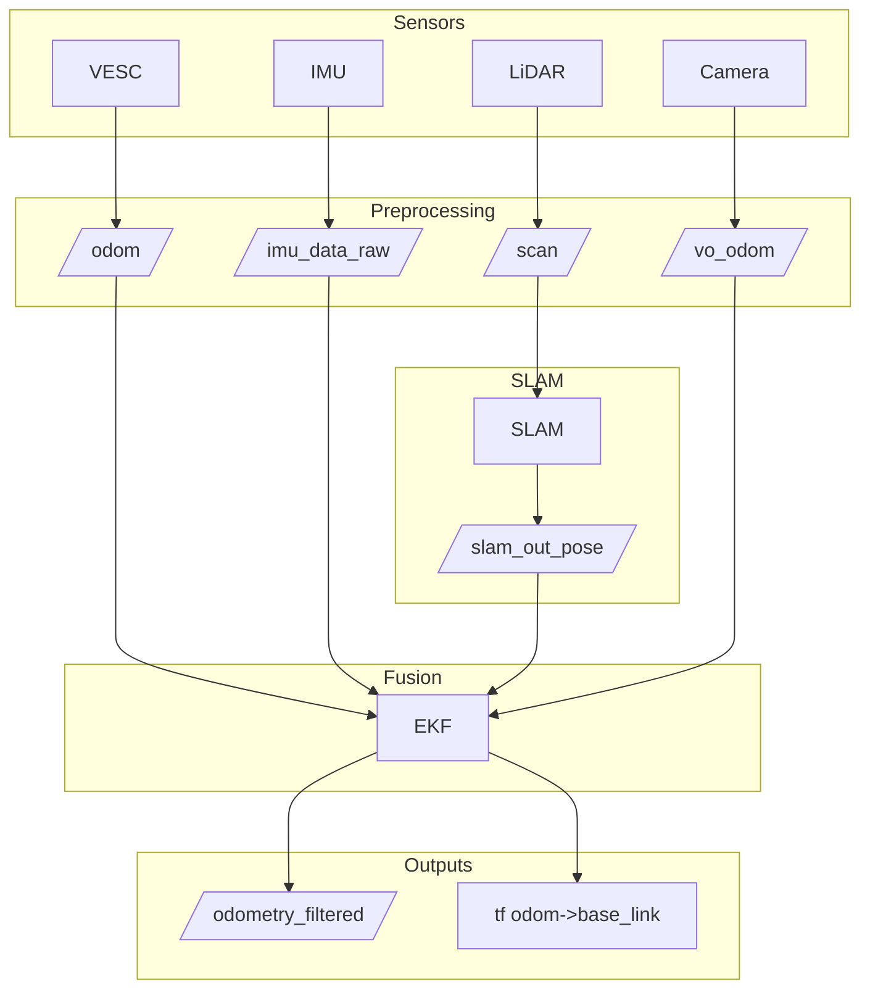

# F1TENTH Roboracer – State Estimation Architecture

## Overview

This document describes the design and implementation of a state estimation architecture for the F1TENTH autonomous vehicle. The system fuses data from multiple onboard sensors to produce a reliable and consistent estimate of the vehicle's pose and velocity in real time. The estimated state is a critical input to control, planning, and decision-making modules.

---

## State Variables to be Estimated

The following state variables are estimated in our current flat-track racing setup:

- **Position (x, y)** – Vehicle’s horizontal location in the odom frame (meters).
- **Orientation (yaw)** – Vehicle’s heading angle in the plane (radians).
- **Linear velocity (vₓ)** – Forward speed along the x-axis (m/s).
- **Optional lateral velocity (vᵧ)** – Side-slip velocity along the y-axis (m/s), useful for high-speed cornering analysis.
- **Yaw rate (ω_z)** – Angular velocity around the vertical axis (rad/s).

**Why not roll, pitch, vertical position, or vertical acceleration?**  
The Roboracer vehicle operates on a flat, smooth indoor track, so vertical motion is negligible. Roll and pitch are minimal in this context and do not significantly impact control. Estimating them would add noise and complexity without performance benefit at this stage.

---

## Available Sensor Inputs

| Sensor                          | Topic Name               | Message Type                  | Data Provided                                        | Frequency  | Frame ID     |
|---------------------------------|--------------------------|--------------------------------|------------------------------------------------------|------------|--------------|
| Wheel Odometry (VESC)           | `/odom`                  | `nav_msgs/Odometry`            | x, y, yaw (optional), vₓ, vᵧ (optional), yaw rate    | 50–100 Hz  | `odom`       |
| IMU (SparkFun Artemis)          | `/imu/data_raw`          | `sensor_msgs/Imu`              | angular velocity (ω), linear acceleration (aₓ, aᵧ)  | 100–200 Hz | `imu_link`   |
| LiDAR SLAM (Hokuyo UST-10LX)    | `/slam_out_pose`         | `geometry_msgs/PoseStamped`    | absolute x, y, yaw                                   | 5–10 Hz    | `map`        |
| Optional Visual Odometry (VO)   | `/vo_odom`               | `nav_msgs/Odometry`            | relative pose and velocity                          | 10–30 Hz   | `camera_link`|

---

## Selected Estimation Algorithm

We begin with an **Extended Kalman Filter (EKF)** using the `robot_localization` ROS 2 package. The EKF is well-suited for our application because:

- **Nonlinear motion handling** – It accommodates the nonlinear relationship between state variables and sensor measurements in vehicle kinematics.
- **Computational efficiency** – Lightweight enough to run in real time on our embedded hardware.
- **Sensor fusion flexibility** – Supports asynchronous inputs from multiple sensors with different rates.
- **Proven ROS integration** – Widely used and documented in robotics projects.

The modular design of our pipeline allows future upgrades or replacements — for example, pairing EKF with Visual SLAM for drift correction, or moving to a factor-graph-based approach — without requiring major changes to downstream consumers.

---

## Modular State Estimation Pipeline

The state estimation system is built as a modular ROS-based pipeline using the **Extended Kalman Filter (EKF)** implementation from the [`robot_localization`](http://docs.ros.org/en/noetic/api/robot_localization/html/index.html) package. The architecture supports asynchronous sensor updates, incorporates robust sensor fusion techniques, and outputs the estimated state at a fixed rate.

### Key Features
- **Asynchronous Sensor Handling** – Each sensor operates at its own rate; the EKF handles delayed and out-of-order messages.
- **Robust Sensor Fusion** – High-rate wheel odometry and IMU data are fused for smooth, drift-resistant local tracking, with the option to integrate low-rate global corrections from LiDAR-based SLAM.
- **Fixed-Rate Output** – The EKF publishes a fused state estimate at a constant frequency (50–100 Hz) to ensure predictable performance for downstream modules.
- **Planar Motion Mode** – Configured for two-dimensional operation, estimating only x, y, and yaw to match the vehicle’s kinematics.

### Pipeline Components
1. **Sensor Drivers**
   - **VESC 6 MkVI** → `vesc_driver` + `vesc_to_odom` → `/odom`
   - **IMU (SparkFun OpenLog Artemis)** → custom/rosserial node → `/imu/data_raw`
   - **LiDAR (Hokuyo UST-10LX)** → `urg_node` → `/scan` → (optional SLAM node) `/slam_out_pose`
   - **Camera (Intel RealSense D435)** → `realsense2_camera` (reserved for future visual odometry integration)

2. **Fusion Node**
   - `ekf_localization_node` (robot_localization package)
   - Inputs:
     - `/odom` (wheel odometry) – provides forward velocity and relative position changes
     - `/imu/data_raw` (IMU) – provides angular velocity and linear accelerations
     - `/slam_out_pose` (LiDAR pose, optional) – provides absolute position for global correction
   - Outputs:
     - `/odometry/filtered` (`nav_msgs/Odometry`)
     - TF transform `odom → base_link`

3. **Output Consumers**
   - **Control module** – reads velocity and pose for trajectory following
   - **Local planner** – uses fused pose and velocity for path tracking
   - **Finite State Machine (FSM)** – bases state transitions on accurate motion data

---

## Input and Output Interfaces

### Inputs to EKF
| Source | ROS Topic | Message Type | Variables Used |
|--------|-----------|--------------|----------------|
| Wheel Odometry (VESC) | `/odom` | `nav_msgs/Odometry` | x, y, yaw (optional), vx, vy (optional), yaw_rate |
| IMU (Artemis) | `/imu/data_raw` | `sensor_msgs/Imu` | yaw_rate, linear_accel_x, linear_accel_y |
| LiDAR Pose (optional) | `/slam_out_pose` | `geometry_msgs/PoseStamped` | x, y, yaw |

### Outputs from EKF
| ROS Topic | Message Type | Description |
|-----------|--------------|-------------|
| `/odometry/filtered` | `nav_msgs/Odometry` | Fused pose and velocity in the odom frame |
| `/tf` | TF transform | Transformation from `odom` to `base_link` |

---

## Integration with Other Modules
- **Control** – subscribes to `/odometry/filtered` for precise velocity tracking.
- **Planning** – consumes fused pose and velocity for local trajectory generation.
- **FSM** – uses the estimated state for decision-making and safety logic.
- **Visualization & Debugging** – monitored in RViz and `rqt_plot` for validation.

---

## Architecture Diagram

---

## Future Extensions

Planned evolution paths (deferred until the baseline EKF fusion is fully validated):

- Unscented Kalman Filter (UKF): We can later trial `ukf_localization_node` to better handle stronger nonlinear vehicle dynamics (slip, aggressive steering). This will require additional tuning effort (process / measurement covariances, sigma point spread parameters) and possibly an expanded state.
- GPS Integration: Add a GNSS (ideally RTK) receiver (`nmea_navsat_driver` + `navsat_transform_node`) to provide low‑rate absolute pose / velocity for drift correction when outdoors.
- Visual Odometry (VO): Leverage the existing RealSense camera (or a dedicated tracking camera) with VO/SLAM (e.g., ORB-SLAM2, RTAB-Map, VINS-Fusion) to publish a `/vo_odom` topic for indoor / GPS-denied operation.

Each added source increases configuration and covariance tuning complexity (time sync, frame alignment, outlier rejection). We will introduce them incrementally once quantitative EKF performance metrics (pose RMSE, innovation consistency, latency) are established.
